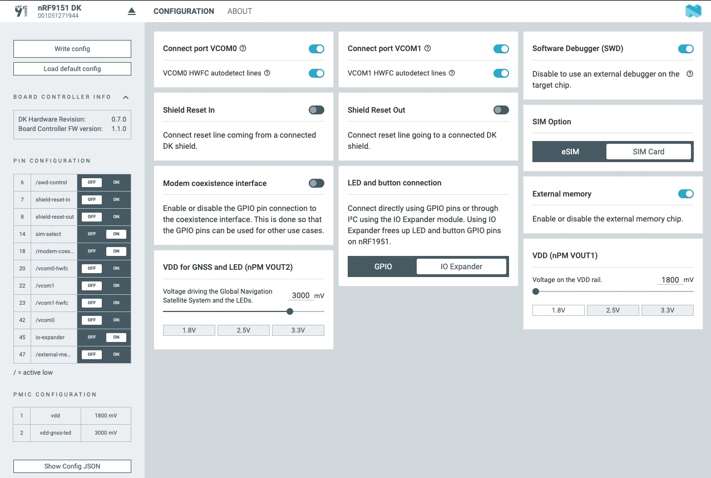

# Edge Impulse firmware for Nordic Semiconductor nRF9161DK and nRF9151DK

[Edge Impulse](https://www.edgeimpulse.com) enables developers to create the next generation of intelligent device solutions with embedded Machine Learning. This repository contains the Edge Impulse firmware for the Nordic Semiconductor nRF91x1DK development boards, in combination with the ST X_NUCLEO-IKS02A1 shield. This combination supports all Edge Impulse device features, including ingestion, remote management and inferencing.

> **Note:** Do you just want to use this development board with Edge Impulse? No need to build this firmware. See [these instructions](https://docs.edgeimpulse.com/docs/development-platforms/officially-supported-mcu-targets/nordic-semi-nrf9161-dk) for prebuilt images and instructions, or use the [data forwarder](https://docs.edgeimpulse.com/docs/tools/edge-impulse-cli/cli-data-forwarder) to capture data from any sensor.

## Building the device firmware (native)

1. Install the [nRF Connect SDK](https://docs.nordicsemi.com/bundle/ncs-2.7.0/page/nrf/getting_started/installing.html) in a *separate* folder from this repository (e.g. `~/repos/ncs`).

    > **Note:** This firmware relays on **NCS v2.7.0**

1. Clone this repository:

    ```bash
    $ git clone https://github.com/edgeimpulse/firmware-nordic-nrf91x1dk
    ```

1. Build the application:

    ```bash
    $ west build -b nrf9161dk/nrf9161/ns
    # or
    $ west build -b nrf9151dk/nrf9151/ns
    ```

## Building the device firmware (Docker)

1. Clone this repository:

    ```bash
    $ git clone https://github.com/edgeimpulse/firmware-nordic-nrf91x1dk
    ```

1. Build the Docker container:

    ```bash
    $ docker build -t edge-impulse-nordic .
    ```

1. Build the application:

    ```bash
    $ docker run --rm -v $PWD:/app edge-impulse-nordic west build -b nrf9161dk/nrf9161/ns
    # or
    $ docker run --rm -v $PWD:/app edge-impulse-nordic west build -b nrf9151dk/nrf9151/ns
    ```

## Flashing

1. Configure the board:
    1. Both boards can be configured with Nordic tool [nRF Connect for Desktop](https://www.nordicsemi.com/Products/Development-tools/nRF-Connect-for-Deskto) -> Board Configurator. All information on how this tool works and how to install it can be found in the [document page](https://docs.nordicsemi.com/bundle/nrf-connect-board-configurator/page/index.html).
    1. For our application both boards need to have next configuration:

    

1. Flashing the application:

    option 1. Connect the board and power on then copy `build/zephyr/zephyr.bin` to the `JLINK` mass storage device.
    option 2. Connect the board and power on then:

    ```bash
    $ west flash
    ```

## Updating your ML model

1. [Train a model in Edge Impulse](https://docs.edgeimpulse.com).
1. On the **Deployment** page in the Studio, export as a C++ library.
1. Remove the content of `ei-model` directory in this repository.
1. Extract the downloaded zip with the C++ library into `ei-model` directory.
1. Rebuild the application.

## Using Remote Ingestion
This firmware is equipped with the Remote Ingestion functionality. It allows you to connect your device to the internet using the LTE connection and start ingesting data remotely from the Edge Impulse Studio!

To build the firmware with the Remote Ingestion, follow the steps above but insted of command:

```bash
$ west build -b nrf9161dk/nrf9161/ns
# or
$ west build -b nrf9151dk/nrf9151/ns
```

Run:

```bash
$ west build -b nrf9161dk/nrf9161/ns -- -DEXTRA_CONF_FILE=overlay-remote-ingestion.conf
# or
$ west build -b nrf9151dk/nrf9151/ns -- -DEXTRA_CONF_FILE=overlay-remote-ingestion.conf
```

And then:
1. Flash the board and connect for the first time to studio.
1. Power off the board and insert the SIM card.
    > **Note:** Make sure your SIM card is active. You can use the iBasis SIM card shipped with the nRF9161/51DK or any other SIM card that supports LTE-M and/or NB-IoT.
1. Be sure that SIM card is enabled in board configuration software (picture above)
1. Power on the board and wait for the connection to be established (nRF9160DK will blink LEDs).
1. Go to your project in Studio and click on **Devices** tab, you should see your device with green mark.

## Troubleshooting

1. In case of any issues, the nRF9160DK with Edge Impulse firmware is exposing a serial console on the first UART port (connection parameters 115200bps 8N1). Open the serial port and reset the device to see the boot messages.
1. If you are using the Remote Ingestion functionality and have problems with connection, in the `overlay-remote-ingestion.conf` file change:

    ```
    CONFIG_REMOTE_INGESTION_LOG_LEVEL_WRN=y
    ```

    to:

    ```
    CONFIG_REMOTE_INGESTION_LOG_LEVEL_DBG=y
    ```

    After rebuilding the firmware and flashing, you should see more detailed logs in the serial console.
